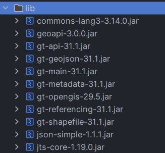
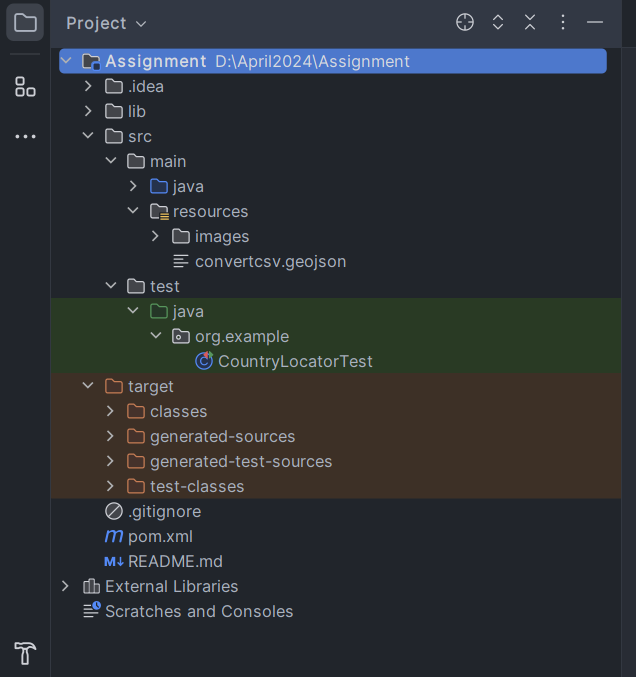

# 🌍 Geo Location to Country Code Resolver

## 🎯 Objective

The objective of this project is to develop a Java program that determines the country code (ISO 3166-1 alpha-2 format) based on given latitude and longitude coordinates, without relying on external APIs or HTTP requests.

## 📜 Table of Contents

1. [Requirements](#requirements)
2. [Setup](#setup)
3. [Usage](#usage)
4. [JUnit Testing](#junit-testing)
5. [Edge Cases](#edge-cases)
6. [Performance Testing](#performance-testing)
7. [Execution](#execution)

## 📋 Requirements

- Java 8 or higher
- Maven
- GeoTools library
- JTS Topology Suite (JTS)

## ⚙️ Setup

1. **Clone the Repository:**

    ```sh
    git clone https://github.com/your-repository/country-locator.git
    cd country-locator
    ```

2. **Add the Dependencies:**
   Add the following dependencies to your `pom.xml` file or download and add them to your classpath:

   

    ```xml
    <dependencies>
        <!-- JUnit for testing -->
        <dependency>
            <groupId>junit</groupId>
            <artifactId>junit</artifactId>
            <version>4.13.1</version>
            <scope>test</scope>
        </dependency>

        <!-- GeoTools Core -->
        <dependency>
            <groupId>org.geotools</groupId>
            <artifactId>gt-main</artifactId>
            <version>27.2</version>
        </dependency>

        <!-- GeoTools GeoJSON -->
        <dependency>
            <groupId>org.geotools</groupId>
            <artifactId>gt-geojson</artifactId>
            <version>27.2</version>
        </dependency>

        <!-- GeoTools Features -->
        <dependency>
            <groupId>org.geotools</groupId>
            <artifactId>gt-api</artifactId>
            <version>27.2</version>
        </dependency>

        <!-- GeoTools Referencing for CRS -->
        <dependency>
            <groupId>org.geotools</groupId>
            <artifactId>gt-referencing</artifactId>
            <version>27.2</version>
        </dependency>

        <!-- GeoTools Shapefile -->
        <dependency>
            <groupId>org.geotools</groupId>
            <artifactId>gt-shapefile</artifactId>
            <version>27.2</version>
        </dependency>

        <!-- GeoTools Utility -->
        <dependency>
            <groupId>org.geotools</groupId>
            <artifactId>gt-metadata</artifactId>
            <version>27.2</version>
        </dependency>

        <!-- GeoTools Logging -->
        <dependency>
            <groupId>org.geotools</groupId>
            <artifactId>gt-opengis</artifactId>
            <version>27.2</version>
        </dependency>

        <!-- json-simple for parsing -->
        <dependency>
            <groupId>com.googlecode.json-simple</groupId>
            <artifactId>json-simple</artifactId>
            <version>1.1.1</version>
        </dependency>

        <!-- JTS for Geometry handling -->
        <dependency>
            <groupId>org.locationtech.jts</groupId>
            <artifactId>jts-core</artifactId>
            <version>1.18.1</version>
        </dependency>

        <!-- Apache Commons Lang -->
        <dependency>
            <groupId>org.apache.commons</groupId>
            <artifactId>commons-lang3</artifactId>
            <version>3.12.0</version>
        </dependency>
    </dependencies>
    ```

3. **GeoJSON File:**
   Ensure you have a GeoJSON file containing country geometries. Place it in the `src/main/resources` directory. For example, `convertcsv.geojson`.

4. **File Structure**


   
## 📖 Usage

1. **Create a CountryLocator instance:**

    ```java
    String geoJsonFilePath = "src/main/resources/countries.geojson";
    CountryLocator locator = new CountryLocator(geoJsonFilePath);
    ```

2. **Get country code for coordinates:**

    ```java
    String countryCode = locator.getCountryCode(1.601554, 42.546245);
    System.out.println("Country Code: " + countryCode);
    ```

3. **Main method example:**

    ```java
    public static void main(String[] args) {
        String geoJsonFilePath = "src/main/resources/countries.geojson";
        CountryLocator locator = new CountryLocator(geoJsonFilePath);
        String countryCode = locator.getCountryCode(1.601554, 42.546245);
        System.out.println("Country Code: " + countryCode);
    }
    ```

## 🧪 JUnit Testing

JUnit tests are provided to ensure the `CountryLocator` class functions correctly. The tests include valid coordinates, invalid coordinates, and edge cases.

1. **Test Cases Method:**
    - `testValidCoordinates`: Tests coordinates that should return valid country codes.
    - `testInvalidCoordinates`: Tests coordinates outside valid ranges and should return null.
    - `testEdgeCases`: Tests edge cases like (0,0), North Pole, South Pole, and International Date Line which should return null.

## ⚠️ Edge Cases

- **Invalid Latitude and Longitude:** Coordinates outside the valid range of latitude (-90 to 90) and longitude (-180 to 180) should return null.
- **Origin Point (0, 0):** Should return null as it does not belong to any country.
- **Poles:** North Pole (90, 0) and South Pole (-90, 0) should return null.
- **International Date Line:** Coordinates on the Date Line (0, -180) and (0, 180) should return null.

## 📊 Performance Testing

Create a performance testing class to:

- Generate 100 requests per second to `getCountryCode`.
- Measure and print the average execution time.

## 🚀 Execution

Execution Flow:

- Run `CountryLocator.main()` to test individual coordinates.
- Use JUnit to run `CountryLocatorTest` for unit tests.
- Execute `PerformanceTest` to evaluate performance metrics.
